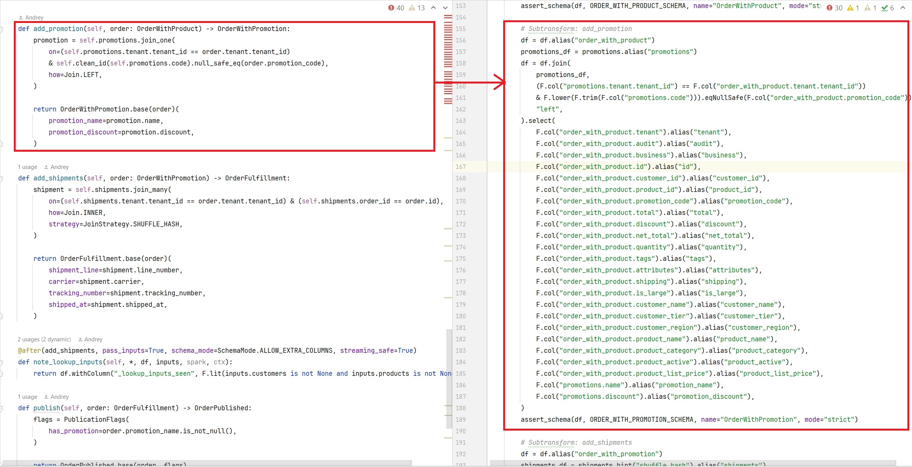

# Structure

**Structure** is a Python-to-PySpark runtime compiler which allows writing Spark data pipelines in Pythonic way, creating optimizer-friendly PySpark code behind the scenes. It can also be used as PySpark code generator: output the schemas and transformations as PySpark code. 

## Less Code, More Spark!

Structure can help replace hand-maintained PySpark boilerplate. 



Structure pipelines express filtering, joins, projections and normalization as plain Python. 

First, define schemas. Second, define transforms (pipelines).

### Example Schema

```python
from structure import Structure, field, String, Decimal


class OrderRaw(Structure):
    id = field(String(), nullable=False)
    customer_id = field(String(), nullable=False)
    product_id = field(String(), nullable=False)
    promotion_code = field(String(), nullable=True, alias="promo-code")
    total = field(String(), nullable=True)


class OrderNormalized(Structure):
    id = field(String(), nullable=False)
    customer_id = field(String(), nullable=False)
    product_id = field(String(), nullable=False)
    promotion_code = field(String(), nullable=True)
    total = field(Decimal(12, 2), nullable=True)


class OrderWithCustomer(OrderNormalized):
    customer_name = field(String(), nullable=True)
    customer_tier = field(String(), nullable=True)

    
class Customer(Structure):
    id = field(String(), nullable=False, primary_key=True)
    name = field(String(), nullable=True)
    tier = field(String(), nullable=True)   
    

class Product(Structure):
    id = field(String(), nullable=False, primary_key=True)
    name = field(String(), nullable=False)    
```

### Example Transform

```python
from orders.schemas.order import OrderRaw, OrderNormalized, OrderWithCustomer
from orders.schemas.customer import Customer

@transform
class EnrichOrders(Transform):

    orders = input(OrderRaw)
    customers = input(Customer)
    products = input(Product)
    enriched = output(OrderEnriched)

    @expr_fn
    def clean_id(value):
        return lower(trim(value))

    @expr_fn
    def normalized_total(value):
        return to_decimal(value, precision=12, scale=2)

    def normalize(self, order: OrderRaw) -> OrderNormalized:
        where(order.id.is_not_null())
        where(order.customer_id.is_not_null())
        where(order.product_id.is_not_null())

        return OrderNormalized.project(order)(
            id=order.id,
            customer_id=self.clean_id(order.customer_id),
            product_id=self.clean_id(order.product_id),
            total=self.normalized_total(order.total),
        )

    @after(normalize, lane=orders)
    def remove_negative_totals(self, *, orders, spark, ctx):
        return orders.where(F.col("total") >= 0)

    def add_customer(self, order: OrderNormalized) -> OrderWithCustomer:
        customer = join_one(
            self.customers,
            on=self.customers.id == order.customer_id,
            how=Join.LEFT,
            hint=JoinHint.BROADCAST,
        )

        return OrderWithCustomer.base(order)(
            customer_name=customer.name,
            customer_tier=customer.tier,
        )

    def add_product(self, order: OrderWithCustomer, product: Product) -> OrderEnriched:
        product = join_one(
            product,
            on=product.id == order.product_id,
            how=Join.LEFT,
        )

        where(product.id.is_not_null())

        return OrderEnriched.base(order)(
            product_name=product.name,
            product_category=product.category,
        )

    @after(add_product, lane=orders, schema_mode=SchemaMode.ALLOW_EXTRA_COLUMNS, project_output=True)
    def add_quality_columns(self, *, orders, spark, ctx):
        return (
            orders
            .withColumn("_has_customer", F.col("customer_name").isNotNull())
            .withColumn("_has_product", F.col("product_name").isNotNull())
        )
```

### Running a Transform

To execute a transform, specify input DataFrames and call .run(session):

```python
from structure import StructureSession
from orders.transforms.order import EnrichOrders

session = StructureSession(spark=spark, ctx=ctx)

result = EnrichOrders(
    orders=orders_df,
    customers=customers_df,
    products=products_df,
).run(session)

enriched_df = result.enriched
```

### Generated PySpark code

We can also generate PySpark source code, if needed for your project.

Example generated PySpark:

```python
from pyspark.sql import DataFrame, SparkSession
from pyspark.sql import functions as F

from orders.transforms.order import EnrichOrders
from structure_generated.orders.pyspark.schemas.order import (
    ORDER_RAW_SCHEMA,
    ORDER_NORMALIZED_SCHEMA,
    ORDER_WITH_CUSTOMER_SCHEMA,
    ORDER_ENRICHED_SCHEMA,
)
from structure_generated.orders.pyspark.schemas.customer import CUSTOMER_SCHEMA
from structure_generated.orders.pyspark.schemas.product import PRODUCT_SCHEMA
from structure_generated.runtime.schema_assert import assert_schema, project_schema


class EnrichOrdersGenerated:

    def __init__(self, *, spark: SparkSession, ctx=None):
        self.spark = spark
        self.ctx = ctx
        self._impl = EnrichOrders()

    def run(
        self,
        *,
        orders: DataFrame,
        customers: DataFrame,
        products: DataFrame,
    ) -> TransformResult:
        assert_schema(orders, ORDER_RAW_SCHEMA, name="OrderRaw", mode="strict")
        assert_schema(customers, CUSTOMER_SCHEMA, name="Customer", mode="strict")
        assert_schema(products, PRODUCT_SCHEMA, name="Product", mode="strict")

        # Subtransform: normalize
        orders = orders.where(
            F.col("id").isNotNull()
            & F.col("customer_id").isNotNull()
            & F.col("product_id").isNotNull()
        ).select(
            F.col("id").alias("id"),
            F.lower(F.trim(F.col("customer_id"))).alias("customer_id"),
            F.lower(F.trim(F.col("product_id"))).alias("product_id"),
            F.col("total").cast("decimal(12,2)").alias("total"),
        )

        orders = self._impl.remove_negative_totals(orders=orders, spark=self.spark, ctx=self.ctx)
        assert_schema(orders, ORDER_NORMALIZED_SCHEMA, name="OrderNormalized", mode="strict")

        # Subtransform: add_customer
        orders = orders.alias("order_normalized")
        customers_df = F.broadcast(customers.alias("customers"))
        orders = orders.join(
            customers_df,
            F.col("customers.id") == F.col("order_normalized.customer_id"),
            "left",
        ).select(
            F.col("order_normalized.id").alias("id"),
            F.col("order_normalized.customer_id").alias("customer_id"),
            F.col("customers.name").alias("customer_name"),
            F.col("customers.tier").alias("customer_tier"),
            F.col("order_normalized.product_id").alias("product_id"),
            F.col("order_normalized.total").alias("total"),
        )
        assert_schema(orders, ORDER_WITH_CUSTOMER_SCHEMA, name="OrderWithCustomer", mode="strict")

        # Subtransform: add_product
        orders = orders.alias("order_with_customer")
        products_df = products.alias("products")
        orders = orders.join(
            products_df,
            F.col("products.id") == F.col("order_with_customer.product_id"),
            "left",
        ).where(
            F.col("products.id").isNotNull()
        ).select(
            F.col("order_with_customer.id").alias("id"),
            F.col("order_with_customer.customer_id").alias("customer_id"),
            F.col("order_with_customer.customer_name").alias("customer_name"),
            F.col("order_with_customer.customer_tier").alias("customer_tier"),
            F.col("order_with_customer.product_id").alias("product_id"),
            F.col("products.name").alias("product_name"),
            F.col("products.category").alias("product_category"),
            F.col("order_with_customer.total").alias("total"),
        )

        orders = self._impl.add_quality_columns(orders=orders, spark=self.spark, ctx=self.ctx)
        assert_schema(orders, ORDER_ENRICHED_SCHEMA, name="OrderEnriched", mode="allow_extra_columns")
        orders = project_schema(orders, ORDER_ENRICHED_SCHEMA)
        assert_schema(orders, ORDER_ENRICHED_SCHEMA, name="OrderEnriched", mode="strict")
        return orders
```

## Performance Focus

Structure is intentionally strict. Compiled subtransforms must lower to Spark-plan-visible expressions.

Unsupported Python operations are rejected at compile time. This is a performance feature: Spark can optimize transformations only when work remains visible in the DataFrame logical plan. Projection, filtering, joins, predicate pushdown, column pruning, aggregation planning, and whole-stage code generation all depend on expressing work through Spark's relational expression model.

For custom logic, create expression helpers with `@expr_fn`. This keeps expression logic compiler-visible and reusable.

Arbitrary PySpark is still supported, but only through explicit hooks. Hooks receive the underlying DataFrame(s) for arbitrary manipulation. Hooks are escape hatches: Structure calls them, records them as opaque boundaries, but does not treat their body as compiler-visible logic.

## Compatibility

Structure targets Python 3.11+, PySpark 3.5.x and 4.0.x, Linux runtimes, and Linux/macOS/Windows development
environments. 

Airflow is supported as a caller of online or generated transforms, not as a dependency.

Spark Connect support is scheduled for v4 unless it can be added earlier without changing the public DSL, generated class API, generated-code review model, or streaming orchestration contract.

See [Compatibility.md](docs/Compatibility.md) for the full versioning and compatibility policy.

## Getting Started

Project overview: [Overview.md](docs/Overview.md) 

Basic concepts: [Basics.md](Basics.md)

Get started: [GettingStarted.md](GettingStarted.md)

## License

LGPL-2.1 + Ethical Use Policy

See [Licence.md]()

## Roadmap

- **v1:** online PySpark execution by default, optional generated PySpark classes, projection, filtering, joins, typed intermediate schemas, hooks, validation, compiler provenance, static dataflow traceability, streaming-compatible transforms, diagnostic links, and setup checks.
- **v2:** windowing, deduplication, aggregations, advanced grouping, Spark higher-order functions,
  caching/persistence/repartition hints, `join_many(...)`, richer explain output, generated docs, and pytest helpers.
- **v3:** full streaming orchestration: `readStream`, `writeStream`, triggers, checkpoints, watermarks,
  output modes, and stateful policies.
- **v4:** Spark Connect support and backend capability reporting.
