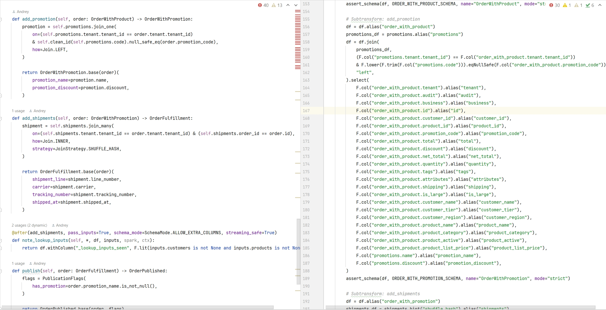

# Structure

**Structure** is a Python-to-PySpark runtime compiler which allows writing Spark data pipelines in Pythonic way, resulting in optimizer-friendly PySpark code creation at runtime. It can also be used as PySpark code generator: output the schemas and transformations as PySpark code. 

## Less Code, More Spark

Structure can help replace hand-maintained PySpark boilerplate. 



Structure allows to express filtering, joins, projections, aggregation as compact Python
code, while Spark still sees optimizer-visible DataFrame logic.

## Nutshell
Define schemas. Define transforms. Run transforms.

### Example Schema

Schema classes compile to PySpark schemas (StructType, StructField).

```python
from structure import *


class OrderRaw(Schema):
    id = string(nullable=False)
    customer_id = string(nullable=False)
    product_id = string(nullable=False)
    promotion_code = string(nullable=True, alias="promo-code")
    total = string(nullable=True)


class OrderNormalized(Schema):
    id = string(nullable=False)
    customer_id = string(nullable=False)
    product_id = string(nullable=False)
    promotion_code = string(nullable=True)
    total = decimal(12, 2, nullable=True)


class OrderWithCustomer(OrderNormalized):
    customer_name = string(nullable=True)
    customer_tier = string(nullable=True)

    
class Customer(Schema):
    id = string(nullable=False)
    name = string(nullable=True)
    tier = string(nullable=True)
    

class Product(Schema):
    id = string(nullable=False)
    name = string(nullable=False)
```

### Example Transform

Transform class compiles into PySpark code operating on DataFrames. (See 'Generated code' section below.)

```python
from orders.schemas.order import OrderRaw, OrderNormalized, OrderWithCustomer
from orders.schemas.customer import Customer

class EnrichOrders(Transform):
    orders = input(OrderRaw)
    customers = input(Customer)
    products = input(Product)
    enriched = output(OrderEnriched)

    def clean_id(value):
        return lower(trim(value))

    def normalized_total(value):
        return to_decimal(value, precision=12, scale=2)

    def normalize(self, order: OrderRaw) -> OrderNormalized:
        where(order.id.is_not_null())
        where(order.customer_id.is_not_null())
        where(order.product_id.is_not_null())

        return OrderNormalized.project(order)(
            id=order.id,
            customer_id=self.clean_id(order.customer_id),
            product_id=self.clean_id(order.product_id),
            total=self.normalized_total(order.total),
        )

    def add_customer(self, order: OrderNormalized, customer: Customer) -> OrderWithCustomer:
        left_join(on=order.customer_id == customer.id)
        return OrderWithCustomer.base(order)(
            customer_name=customer.name,
            customer_tier=customer.tier,
        )

    def add_product(self, order: OrderWithCustomer, product: Product) -> OrderEnriched:
        left_join(on=order.product_id == product.id)
        return OrderEnriched.base(order)(
            product_name=product.name,
            product_category=product.category,
        )

    @raw(inout=lane(orders) | lane(orders))
    def add_quality_columns(self, *, orders, spark, ctx):
        return (
            orders
            .withColumn("_has_customer", F.col("customer_name").isNotNull())
            .withColumn("_has_product", F.col("product_name").isNotNull())
        )
```

### Running a Transform

Create transform object, specify input data frames and call `.run(session)`:

```python
from structure import *
from orders.transforms.order import EnrichOrders

config = StructureConfig.resolve(project_root=".")
session = StructureSession(spark=spark, ctx=ctx, config=config)

result = EnrichOrders(
    orders=orders_df,
    customers=customers_df,
    products=products_df,
).run(session)

enriched_df = result.enriched
```

On invocation of run(), Structure compiles Transform and all its dependencies into an in-memory artifact for execution - the execution plan. It executes the plan by translating ('lowering') it into PySpark statements. PySpark code can also be saved to disk, if your project prefers to have generated code. Execution order follows the declared order of transform's 'step' methods - the methods that take schema object(s) and  return schema object(s).

### Generated PySpark Code

The generated  PySpark code looks similar to this:

```python
from pyspark.sql import DataFrame, SparkSession
from pyspark.sql import functions as F

from orders.transforms.order import EnrichOrders
from structure_generated.orders.pyspark.schemas.order import (
    ORDER_RAW_SCHEMA,
    ORDER_NORMALIZED_SCHEMA,
    ORDER_WITH_CUSTOMER_SCHEMA,
    ORDER_ENRICHED_SCHEMA,
)
from structure_generated.orders.pyspark.schemas.customer import CUSTOMER_SCHEMA
from structure_generated.orders.pyspark.schemas.product import PRODUCT_SCHEMA
from structure_generated.runtime.schema_assert import assert_schema, project_schema


class EnrichOrdersGenerated:

    def __init__(self, *, spark: SparkSession, ctx=None):
        self.spark = spark
        self.ctx = ctx
        self._impl = EnrichOrders()

    def run(
        self,
        *,
        orders: DataFrame,
        customers: DataFrame,
        products: DataFrame,
    ) -> TransformResult:
        assert_schema(orders, ORDER_RAW_SCHEMA, name="OrderRaw", mode="strict")
        assert_schema(customers, CUSTOMER_SCHEMA, name="Customer", mode="strict")
        assert_schema(products, PRODUCT_SCHEMA, name="Product", mode="strict")

        # Step method: normalize
        orders = orders.where(
            F.col("id").isNotNull()
            & F.col("customer_id").isNotNull()
            & F.col("product_id").isNotNull()
        ).select(
            F.col("id").alias("id"),
            F.lower(F.trim(F.col("customer_id"))).alias("customer_id"),
            F.lower(F.trim(F.col("product_id"))).alias("product_id"),
            F.col("total").cast("decimal(12,2)").alias("total"),
        )

        orders = self._impl.remove_negative_totals(orders=orders, spark=self.spark, ctx=self.ctx)
        assert_schema(orders, ORDER_NORMALIZED_SCHEMA, name="OrderNormalized", mode="strict")

        # Step method: add_customer
        orders = orders.alias("order_normalized")
        customers_df = F.broadcast(customers.alias("customers"))
        orders = orders.join(
            customers_df,
            F.col("order_normalized.customer_id") == F.col("customers.id"),
            "left",
        ).select(
            F.col("order_normalized.id").alias("id"),
            F.col("order_normalized.customer_id").alias("customer_id"),
            F.col("customers.name").alias("customer_name"),
            F.col("customers.tier").alias("customer_tier"),
            F.col("order_normalized.product_id").alias("product_id"),
            F.col("order_normalized.total").alias("total"),
        )
        assert_schema(orders, ORDER_WITH_CUSTOMER_SCHEMA, name="OrderWithCustomer", mode="strict")

        # Step method: add_product
        orders = orders.alias("order_with_customer")
        products_df = products.alias("products")
        orders = orders.join(
            products_df,
            F.col("order_with_customer.product_id") == F.col("products.id"),
            "left",
        ).where(
            F.col("products.id").isNotNull()
        ).select(
            F.col("order_with_customer.id").alias("id"),
            F.col("order_with_customer.customer_id").alias("customer_id"),
            F.col("order_with_customer.customer_name").alias("customer_name"),
            F.col("order_with_customer.customer_tier").alias("customer_tier"),
            F.col("order_with_customer.product_id").alias("product_id"),
            F.col("products.name").alias("product_name"),
            F.col("products.category").alias("product_category"),
            F.col("order_with_customer.total").alias("total"),
        )

        orders = self._impl.add_quality_columns(orders=orders, spark=self.spark, ctx=self.ctx)
        assert_schema(orders, ORDER_ENRICHED_SCHEMA, name="OrderEnriched", mode="allow_extra_columns")
        orders = project_schema(orders, ORDER_ENRICHED_SCHEMA)
        assert_schema(orders, ORDER_ENRICHED_SCHEMA, name="OrderEnriched", mode="strict")
        return orders
```

## API Coverage

Structure tries to cover most of PySpark APIs related to data transformation, such as projection, filtering, joins, aggregation, deduplication, windowing, higher order functions. Example of a less-trivial analytical transform:

```python
class OrderAnalytics(Transform):
    orders = input(OrderFulfillment)
    collections = input(OrderCollectionSource)
    product_summaries = output(ProductDailySummary)
    revenue_rollups = output(OrderRevenueRollup)
    product_cubes = output(OrderProductCube)
    customer_windows = output(OrderCustomerWindow)
    collection_profiles = output(OrderCollectionProfile)

  def product_daily_summary(self, order: OrderFulfillment) -> ProductDailySummary:
      group_by(
          tenant_id=order.tenant.tenant_id,
          product_id=order.product_id,
          order_date=order.business.order_date,
      )

      return ProductDailySummary(
          tenant=order.tenant,
          product_id=order.product_id,
          order_date=order.business.order_date,
          order_count=count(),
          distinct_customers=count_distinct(order.customer_id),
          units=sum(order.quantity),
          min_units=min(order.quantity),
          max_units=max(order.quantity),
          avg_units=avg(order.quantity),
          gross_total=sum(order.total),
      )

    def revenue_rollup(self, order: OrderFulfillment) -> OrderRevenueRollup:
        rollup(
            tenant_id=order.tenant.tenant_id,
            product_category=order.product_category,
            order_date=order.business.order_date,
        )

        return OrderRevenueRollup(
            tenant_id=order.tenant.tenant_id,
            product_category=order.product_category,
            order_date=order.business.order_date,
            grouping_id=grouping_id(),
            category_subtotal=is_grouped(order.product_category),
            order_count=count(),
            large_order_count=count(where=order.is_large),
            large_units=sum(order.quantity, where=order.is_large),
            any_large_order=bool_or(order.is_large),
            all_large_orders=bool_and(order.is_large),
            quantity_stddev=stddev(order.quantity),
            quantity_variance=variance(order.quantity),
            quantity_median=approx_percentile(order.quantity, 0.5, accuracy=100),
            quantity_total=sum(order.quantity),
            quantity_price_corr=corr(order.quantity, order.product_list_price),
            quantity_price_covar=covar(order.quantity, order.product_list_price),
            estimated_customers=approx_count_distinct(order.customer_id),
            first_customer_id=first_value(order.customer_id, order_by=order.quantity),
            last_customer_id=last_value(order.customer_id, order_by=order.quantity),
            customer_ids=collect_set(order.customer_id),
            order_ids=collect_list(order.id),
        )

    def product_cube(self, order: OrderFulfillment) -> OrderProductCube:
        cube(
            tenant_id=order.tenant.tenant_id,
            product_category=order.product_category,
            customer_tier=order.customer_tier,
        )

        return OrderProductCube(
            tenant_id=order.tenant.tenant_id,
            product_category=order.product_category,
            customer_tier=order.customer_tier,
            grouping_id=grouping_id(),
            order_count=count(),
            distinct_customers=count_distinct(order.customer_id),
            gross_total=sum(order.total),
        )

    def customer_window(self, order: OrderFulfillment) -> OrderCustomerWindow:
        customer_window = window(
            partition_by=order.customer_id,
            order_by=order.quantity,
            frame=rows_between(preceding(2), current_row()),
        )

        return OrderCustomerWindow(
            tenant_id=order.tenant.tenant_id,
            customer_id=order.customer_id,
            order_id=order.id,
            quantity=order.quantity,
            percent_rank=percent_rank(over=customer_window),
            cume_dist=cume_dist(over=customer_window),
            quantity_tile=ntile(2, over=customer_window),
            first_order_id=first_value(order.id, over=customer_window),
            last_order_id=last_value(order.id, over=customer_window),
            second_order_id=nth_value(order.id, 2, over=customer_window),
            running_units=window_sum(order.quantity, over=customer_window),
            running_avg_units=window_avg(order.quantity, over=customer_window),
            running_min_units=window_min(order.quantity, over=customer_window),
            running_max_units=window_max(order.quantity, over=customer_window),
            running_order_count=window_count(over=customer_window),
        )

    def collection_profile(self, row: OrderCollectionSource) -> OrderCollectionProfile:
        normalized_attributes = map_filter(
            map_transform_keys(
                map_transform_values(row.attributes, lambda key, value: lower(trim(value))),
                lambda key, value: lower(trim(key)),
            ),
            lambda key, value: value.is_not_null(),
        )

return OrderCollectionProfile(
    tag_count=size(row.tags),
    contains_priority=array_contains(row.tags, "priority"),
    contains_region=map_contains_key(row.extra_attributes, "Region"),
    default_tags=array("priority", "standard"),
    repeated_tags=array_repeat("priority", 2),
    all_tags=array_union(row.tags, row.extra_tags),
    tags_without_extra=array_except(row.tags, row.extra_tags),
    first_tag=element_at(row.tags, 1),
    safe_tag=try_element_at(row.tags, 2),
            id=row.id,
            normalized_tags=arr_distinct(
              arr_zip_with(row.tags, row.tags, lambda left, right: lower(trim(left)))),
            sorted_tags=arr_sort_by(row.tags, lambda tag: lower(trim(tag))),
            flat_tags=arr_flatten(row.nested_tags),
            score_total=arr_aggregate(row.scores, 0, lambda acc, item: acc + item),
            tag_position=arr_position(row.tags, "priority"),
            has_priority=arr_exists(row.tags, lambda tag: lower(trim(tag)) == "priority"),
            all_tags_present=arr_forall(row.tags, lambda tag: tag.is_not_null()),
            normalized_attributes=normalized_attributes,
            zipped_attributes=map_zip_with(
              row.attributes, row.attributes, lambda key, left, right: lower(trim(left))),
            attribute_keys=map_keys(row.attributes),
            attribute_values=map_values(row.attributes),
    roundtrip_attributes=map_from_entries(map_entries(row.attributes)),
    merged_attributes=map_concat(row.attributes, row.extra_attributes),
)
```

## Performance Focus

Structure is intentionally strict: compiled methods must lower to Spark Optimizer-visible expressions.

Unsupported Python operations are rejected. This is a performance feature: Spark can optimize transformations only when work remains visible in the DataFrame logical plan. Projection, filtering, joins, predicate pushdown, column pruning, aggregation planning, and whole-stage code generation all depend on expressing work through Spark's relational expression model.

Arbitrary PySpark is still supported, but only through explicit @raw hooks around step method. Hooks receive the underlying DataFrame(s) for arbitrary manipulation. Hooks are escape hatches: Structure calls them, records them as opaque boundaries, but does not treat their body as compiler-visible logic.

## IDE Friendliness

Python-first approach allows for such IDE conveniences, as:
- Jumping to schema definitions from arbitrary location in code.
- Navigating to the code where a schema or a transform class or method is used.
- Displaying inheritance hierarchies of schemas/transforms.

## Out of scope

Structure focuses on data transformation. Loading, writing to storage, orchestrating and other activities outside of data transformation is the responsibility of end-user.

## Compatibility

Structure targets Python 3.11+, PySpark 3.5.x and 4.0.x, Linux runtimes, and Linux/macOS/Windows development
environments.

Airflow can run transforms or call generated PySpark code. It is not a Structure dependency.

See [Compatibility.md](docs/Compatibility.md) for the versioning and compatibility policy.

## Next Steps

Read QuickRef: [QuickRef.md](docs/QuickRef.md)

## Development

Development overview: [Development.md](docs/dev/Development.md)

## Support and Contributions

Structure is built for engineers. For a code-related support request, open an issue with a minimal, runnable example
and the complete output it produces, including the error and traceback where applicable. Explain the expected result
as well. Descriptions without a reproducible example cannot be diagnosed reliably.

Code-related issues also need an accompanying pull request that contains the proposed fix and a regression test. The
example gives maintainers a shared starting point; the pull request turns that knowledge into a reviewable,
verifiable improvement. See [developer support](docs/dev/Development.md#support-and-contributions) for the full
submission contract.

## License

LGPL-2.1 + Ethical Use Policy

See [License.md](License.md)

## Roadmap

- **v1:** online PySpark execution by default, optional generated PySpark classes, projection, filtering,
  joins, typed intermediate schemas, hooks, validation, compiler provenance, static dataflow traceability,
  streaming-compatible transforms, diagnostic links, and setup checks.
- **v2:** mainstream analytical features: existence joins, `inner_join(...)`, broad rowset joins, deterministic lookup
  dedupe, temporal validity joins, windowing, aggregations, advanced grouping, Spark higher-order functions,
  cache/persist first-slice directives, Spark Connect support for completed batch features, and static streaming
  compatibility diagnostics for caller-owned streaming DataFrames.
- **v3:** PySpark parity gap closure and compiler-visible streaming transformation hardening. Sources, sinks,
  triggers, checkpoints, output modes, and query lifecycle remain caller-owned. See [v3 highlights](docs/V3.md).
- **v4:** broader, predictable PySpark transformation API coverage across expressions, nested values, relational
  transforms, joins, aggregations, windows, and collections. Loading, storage, and orchestration remain caller-owned.
  See [v4 highlights](docs/V4.md).
